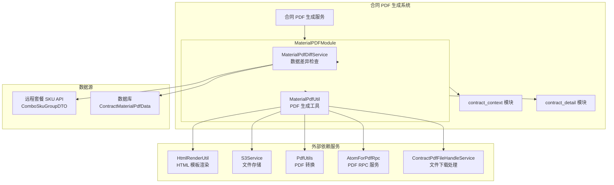
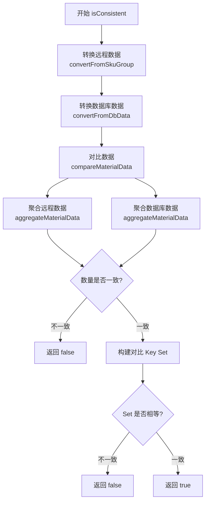
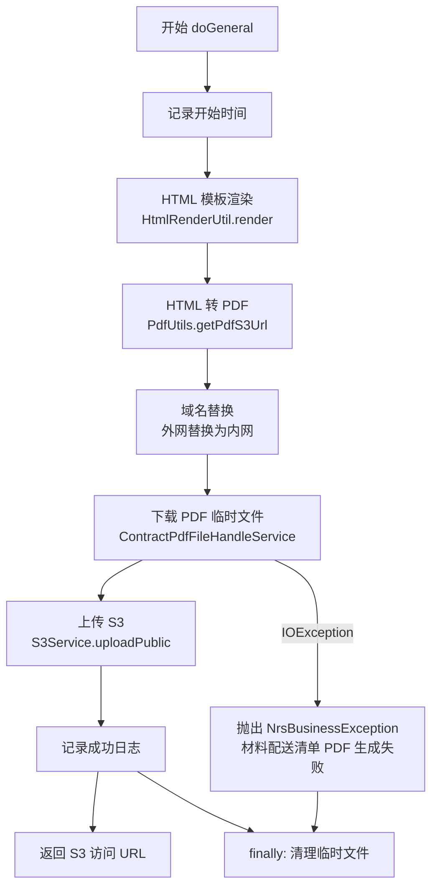
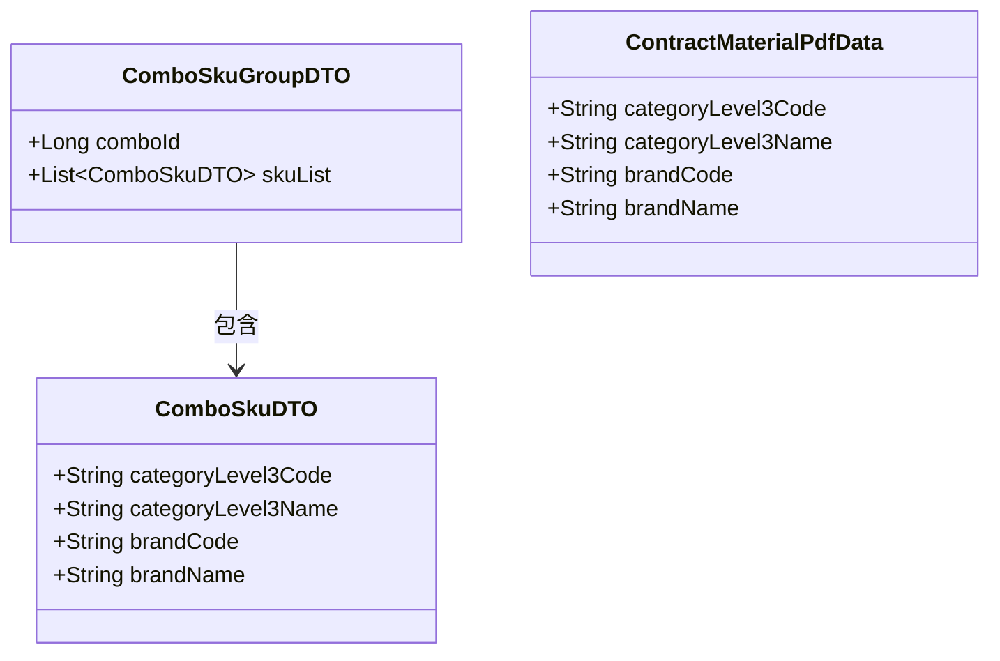
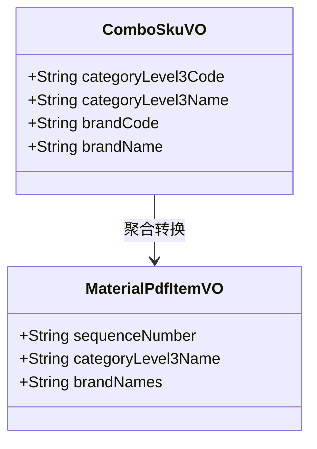
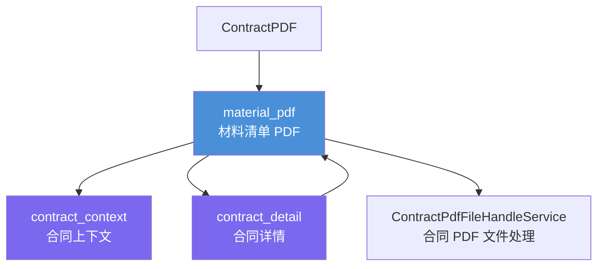
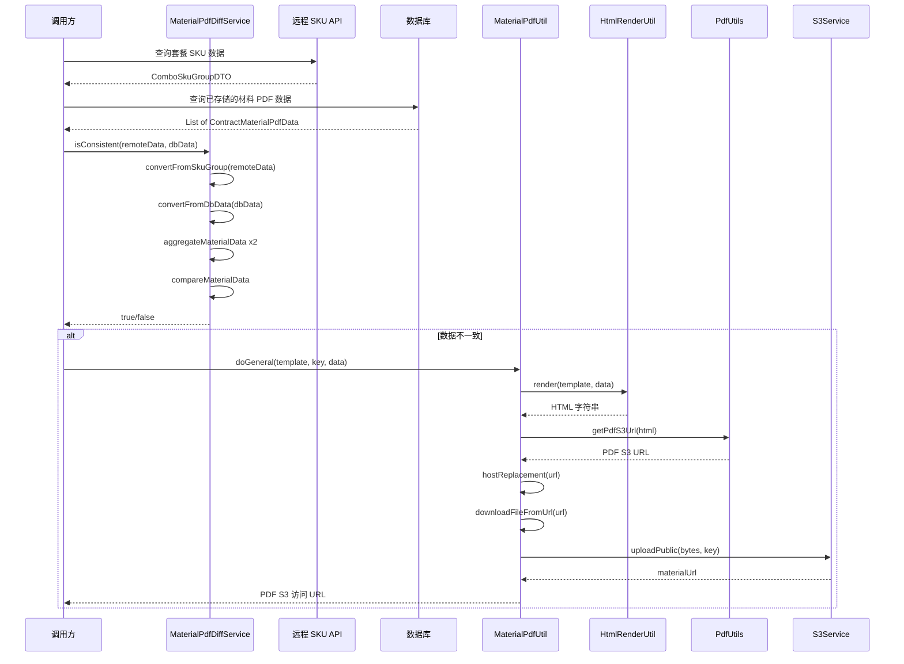
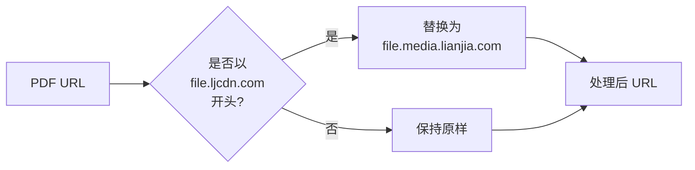

# Material PDF 模块

## 1. 模块概述

Material PDF 模块负责**合同材料配送清单 PDF** 的生成与数据一致性检查。当合同涉及套餐材料时，该模块承担两个核心职责：

1. **数据差异检测**（`MaterialPdfDiffService`）：对比远程实时查询的套餐 SKU 数据与数据库中已存储的材料 PDF 数据，判断是否需要重新生成 PDF。
2. **PDF 生成与上传**（`MaterialPdfUtil`）：将材料数据渲染为 HTML 模板，转换为 PDF 文件，并上传至 S3 存储服务。

该模块是合同 PDF 生成流水线中的一个子环节，专注于材料清单维度的 PDF 管理。

---

## 2. 系统架构

---

## 3. 核心组件详解

### 3.1 MaterialPdfDiffService — 数据差异检查服务

**职责**：比较远程实时数据与数据库持久化数据，决定是否需要重新生成材料清单 PDF。

#### 核心方法

| 方法 | 可见性 | 说明 |
|------|--------|------|
| `isConsistent(ComboSkuGroupDTO, List<ContractMaterialPdfData>)` | public | 入口方法，判断远程数据与 DB 数据是否一致 |
| `convertFromSkuGroup(ComboSkuGroupDTO)` | public | 将远程 DTO 转换为内部 VO，按 `categoryLevel3Code#brandCode` 去重 |
| `convertFromDbData(List<ContractMaterialPdfData>)` | public | 将数据库模型转换为内部 VO |
| `compareMaterialData(List<ComboSkuVO>, List<ComboSkuVO>)` | private | 核心对比逻辑，聚合后比较 key 集合 |
| `aggregateMaterialData(List<ComboSkuVO>)` | private | 按三级类目分组、品牌聚合、过滤"其他"、排序 |
| `buildMaterialItemCompareKey(MaterialPdfItemVO)` | private | 构建对比唯一键：`categoryLevel3Name|brandNames` |

#### 数据一致性检查流程

#### 数据聚合规则

远程数据和数据库数据在对比前均需经过统一的聚合处理，确保比较维度一致：

**关键业务规则**：
- **去重策略**：远程数据按 `categoryLevel3Code + brandCode` 组合键去重，保留第一条记录
- **品牌过滤**：brandName 为"其他"的项不参与对比
- **空品牌处理**：若某三级类目下所有品牌均为"其他"，该类目整体不展示
- **对比键格式**：`categoryLevel3Name|brandNames`，通过 Set 相等性判断整体一致性

### 3.2 MaterialPdfUtil — PDF 生成工具

**职责**：将材料数据通过 HTML 模板渲染为 PDF 文件，上传至 S3 并返回访问 URL。

#### 核心方法

| 方法 | 说明 |
|------|------|
| `doGeneral(templateFile, key, data)` | 生成 PDF 并上传 S3 的完整流程 |
| `hostReplacement(pdfS3Url)` | URL 域名替换（外网 → 内网） |

#### PDF 生成流程

#### 外部依赖说明

| 依赖 | 类型 | 职责 |
|------|------|------|
| `HtmlRenderUtil` | 工具类 | 使用模板文件 + 数据渲染 HTML 字符串 |
| `PdfUtils` | 工具类 | 将 HTML 转换为 PDF 并上传，返回 S3 URL |
| `S3Service` | 服务 | 文件存储服务，`uploadPublic` 上传公开访问文件 |
| `ContractPdfFileHandleService` | 服务 | 从 URL 下载文件到本地临时路径 |
| `AtomForPdfRpc` | RPC 客户端 | PDF 相关的远程调用（当前类中已注入但未直接使用） |

---

## 4. 数据模型

### 4.1 输入数据模型

### 4.2 内部转换模型

**转换关系**：
- `ComboSkuGroupDTO` → `List<ComboSkuVO>`：通过 `convertFromSkuGroup`，按 `categoryLevel3Code#brandCode` 去重
- `List<ContractMaterialPdfData>` → `List<ComboSkuVO>`：通过 `convertFromDbData`，字段映射
- `List<ComboSkuVO>` → `List<MaterialPdfItemVO>`：通过 `aggregateMaterialData`，按三级类目分组聚合品牌

---

## 5. 模块间依赖关系

**与相关模块的关系**：

| 模块 | 关系 | 说明 |
|------|------|------|
| [contract_context](contract_context.md) | 上下文依赖 | 材料 PDF 生成需要合同上下文信息（如合同类型、项目信息） |
| [contract_detail](contract_detail.md) | 数据依赖 | 从合同详情中获取材料相关数据，驱动 PDF 内容填充 |
| [contract_pdf_by_self](contract_pdf_by_self.md) | 并列关系 | 同为合同 PDF 子模块，contract_pdf_by_self 负责合同正文 PDF，本模块负责材料清单 PDF |
| [terminal_contract_pdf](terminal_contract_pdf.md) | 并列关系 | 同为合同 PDF 子模块，负责终止合同 PDF |

---

## 6. 完整数据流

---

## 7. 关键设计模式

### 7.1 策略模式的隐式应用

虽然本模块未直接定义策略接口，但其数据转换流程体现了**标准化管道**思想：无论数据来源是远程 API（`ComboSkuGroupDTO`）还是数据库（`ContractMaterialPdfData`），均先统一转换为 `ComboSkuVO` 中间模型，再进入相同的聚合逻辑进行对比。这种设计确保了比较维度的对称性。

### 7.2 防御性编程

- `convertFromSkuGroup` 对 null 输入返回空列表，避免 NPE
- `compareMaterialData` 对 null 列表直接返回 false（不一致）
- `doGeneral` 在 finally 块中清理临时文件，防止磁盘泄漏
- 远程数据转换时使用 `LinkedHashMap` 保持顺序，确保对比结果的确定性

### 7.3 域名替换策略

`MaterialPdfUtil.hostReplacement` 实现了内网/外网域名映射：

该策略确保在内网环境下文件下载使用内网地址，提升传输效率。

---

## 8. 注意事项与维护建议

1. **临时类归属**：`MaterialPdfUtil` 源码注释标注"临时先放这里, 后续统一管理维护到合理的地方"，建议后续归入统一的 PDF 工具层。
2. **AtomForPdfRpc 未使用**：`MaterialPdfUtil` 注入了 `AtomForPdfRpc` 但当前未在方法中直接使用，可能是预留接口或历史遗留，建议确认后移除。
3. **对比键的稳定性**：`buildMaterialItemCompareKey` 使用 `categoryLevel3Name|brandNames` 作为唯一键，若 categoryLevel3Name 或品牌名包含 `|` 分隔符可能导致误判，建议评估是否需要转义处理。
4. **聚合逻辑对称性**：远程数据和数据库数据使用同一个 `aggregateMaterialData` 方法聚合，这是正确性的关键保障——若后续修改聚合规则，两边会同步生效。
5. **性能考量**：`doGeneral` 方法涉及模板渲染、PDF 转换、文件下载和 S3 上传多个 I/O 操作，整体耗时较长，建议在调用方做好超时控制和异步处理。
