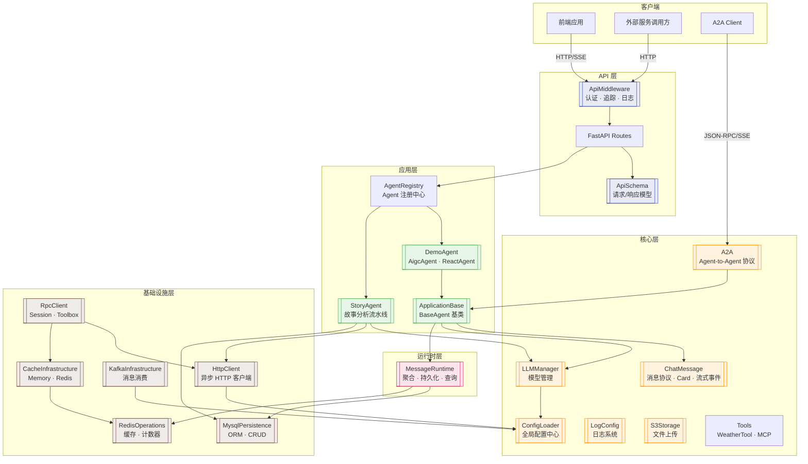
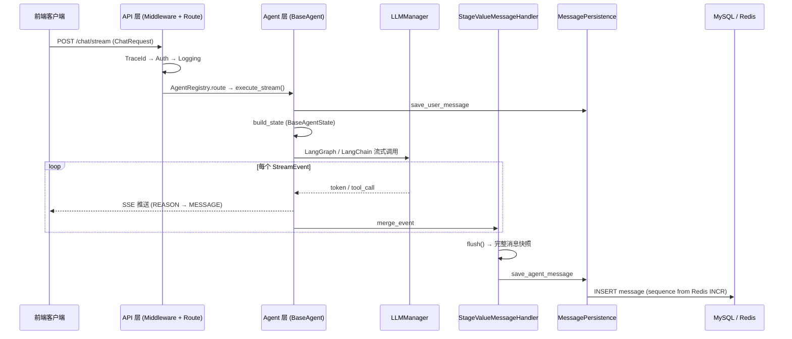
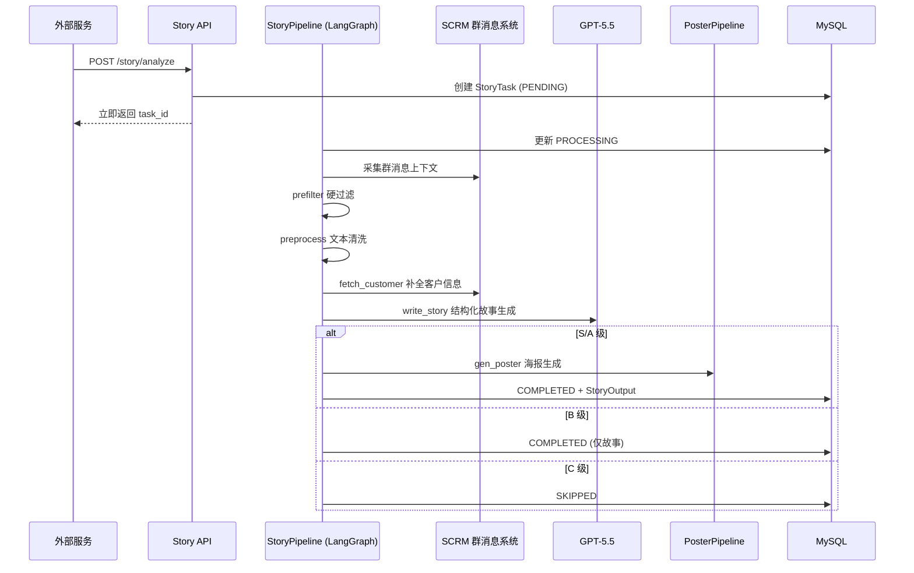

# AIGC Agent 仓库概览

## 仓库目的

AIGC Agent 是一个基于 Python 构建的 **AI Agent 对话与业务自动化平台**，采用 FastAPI + LangGraph + AgentScope 技术栈，提供以下核心能力：

- **多 Agent 对话服务**：支持简单流式 Agent（AigcAgent）和 LangGraph React 模式 Agent（ReactAgent），通过 SSE 实现实时流式响应
- **客户故事自动分析**：从企微群聊消息中自动挖掘、评级、生成客户故事并产出品牌海报物料（StoryAgent）
- **标准化 Agent 通信**：基于 Google A2A 协议实现 Agent 间的服务发现与任务编排
- **全链路基础设施**：提供统一的配置管理、消息持久化、缓存、Kafka 消费、日志追踪等企业级基础能力

## 端到端架构

## 核心数据流

### 聊天对话流

### 故事分析流

## 核心模块索引

### API 层

| 模块 | 职责 | 文档 |
|------|------|------|
| **ApiMiddleware** | HTTP 中间件：认证鉴权（AuthMiddleware）、请求追踪（TraceIdMiddleware）、请求日志（RequestLoggingMiddleware） | [ApiMiddleware](ApiMiddleware.md) |
| **ApiSchema** | API 数据契约层：请求/响应 Pydantic 模型（ChatRequest、BaseResponse、StoryAnalyzeRequest 等） | [ApiSchema](ApiSchema.md) |

### 应用层

| 模块 | 职责 | 文档 |
|------|------|------|
| **ApplicationBase** | Agent 框架基类：BaseAgent 生命周期管理、AgentRegistry 注册路由、ConversationManager 会话管理、Checkpointer 持久化 | [ApplicationBase](ApplicationBase.md) |
| **DemoAgent** | 示例 Agent：AigcAgent（简单流式）和 ReactAgent（LangGraph 双阶段推理 + MCP 工具调用） | [DemoAgent](DemoAgent.md) |
| **StoryAgent** | 故事分析流水线：群聊消息采集 → 预过滤 → LLM 故事生成 → 评级 → 海报产出，基于 LangGraph StateGraph 编排 | [StoryAgent](StoryAgent.md) |

### 核心层

| 模块 | 职责 | 文档 |
|------|------|------|
| **A2A** | Google A2A 协议实现：JSON-RPC 2.0 服务端、TaskManager 抽象、Agent Card 服务发现、SSE 流式订阅 | [A2A](A2A.md) |
| **ConfigLoader** | 全局配置中心：YAML 加载、多环境切换（dev/test/preview/prod）、深度合并、单例点号语法访问 | [ConfigLoader](ConfigLoader.md) |
| **EventRegistry** | 事件注册表：EventType 枚举定义、事件-监听器映射、自动注册机制，配合 EventBus 实现 Pub/Sub | [EventRegistry](EventRegistry.md) |
| **LLMManager** | LLM 统一管理层：多厂商模型（OpenAI/豆包/通义/DeepSeek）实例创建、缓存、工厂分发 | [LLMManager](LLMManager.md) |
| **LogConfig** | 日志基础设施：loguru 配置、InterceptHandler 拦截第三方日志、ContextVar trace_id 传播 | [LogConfig](LogConfig.md) |
| **ChatMessage** | 消息协议层：Card 卡片生命周期管理、StreamEvent 流式事件模型、ProtocolWrapper 序列化、emitter 事件发射 | [ChatMessage](ChatMessage.md) |
| **S3Storage** | 文件存储：S3 分片上传（创建 → 并发上传 → 合并）、预签名 URL、懒加载单例 | [S3Storage](S3Storage.md) |
| **WeatherTool** | 工具层：LangChain @tool 天气查询（Mock）、工具注册与 Agent 集成 | [WeatherTool](WeatherTool.md) |

### 运行时层

| 模块 | 职责 | 文档 |
|------|------|------|
| **MessageRuntime** | 消息运行时：StageValueMessageHandler 增量聚合、MessagePersistence 持久化（Redis 序列号 + MySQL 写入）、MessageService 查询格式化 | [MessageRuntime](MessageRuntime.md) |

### 基础设施层

| 模块 | 职责 | 文档 |
|------|------|------|
| **MysqlPersistence** | MySQL 持久化：SQLAlchemy 2.0 异步引擎、BaseCRUD 泛型仓库、Conversation/Session/Message/StoryORM 模型 | [MysqlPersistence](MysqlPersistence.md) |
| **RedisOperations** | Redis 操作层：String/Hash/List/Set/ZSet 五种数据结构封装、统一 redis_execute 入口、自动 JSON 序列化 | [RedisOperations](RedisOperations.md) |
| **CacheInfrastructure** | 缓存基础设施：策略模式（MemoryCache LRU + RedisCache）、CacheManager 单例门面、可配置后端切换 | [CacheInfrastructure](CacheInfrastructure.md) |
| **KafkaInfrastructure** | Kafka 消费层：`@kafka_listener` 装饰器声明式注册、MessageContext 消息封装、ListenerRunner 全异步消费、at-least-once 语义 | [KafkaInfrastructure](KafkaInfrastructure.md) |
| **HttpClient** | 异步 HTTP 客户端：AsyncHttpClientManager 连接池管理、BaseAsyncHttpClient 模板方法基类、httpx 封装 | [HttpClient](HttpClient.md) |
| **RpcClient** | 远程服务客户端：SessionRpcClient（Token 验证）、ToolboxRpcClient（Prompt 获取 + 缓存） | [RpcClient](RpcClient.md) |

### 工具层

| 模块 | 职责 | 文档 |
|------|------|------|
| **TimeUtils** | 时间工具：timestamp/datetime/string 互转、容错安全默认值、渐进式解析策略 | [TimeUtils](TimeUtils.md) |

## 关键设计模式

| 模式 | 应用位置 | 说明 |
|------|---------|------|
| **模板方法** | BaseAgent.execute_stream() | 基类定义固定执行骨架，子类通过 build_graph() / extend_state() 定制 |
| **单例模式** | ConfigLoader、LLMManager、AgentRegistry、CacheManager | 全局唯一实例，避免资源浪费 |
| **策略模式** | CacheStrategy（Memory/Redis）、CheckpointerBackend（Memory/MySQL） | 运行时可切换实现，对业务透明 |
| **注册表模式** | AgentRegistry、@kafka_listener 装饰器 | 声明式注册 + 动态发现，解耦定义与使用 |
| **工厂方法** | create_checkpointer()、LLMManager._create_llm() | 根据配置参数创建不同实例 |
| **事件溯源** | Card → StreamEvent → StageValueMessageHandler | 同一事件流同时服务前端推送和持久化聚合 |
| **装饰器注册** | @kafka_listener、@cache、@tool | 声明式编程，减少样板代码 |