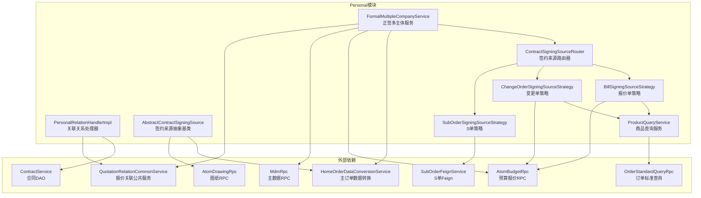
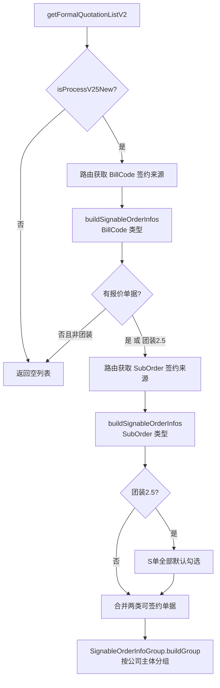
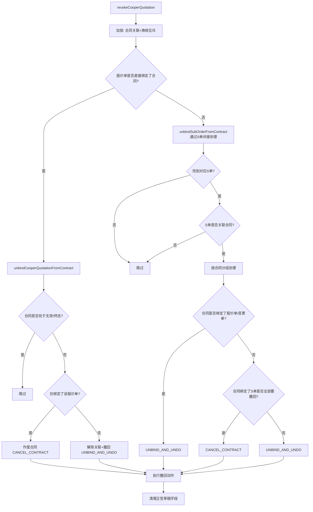
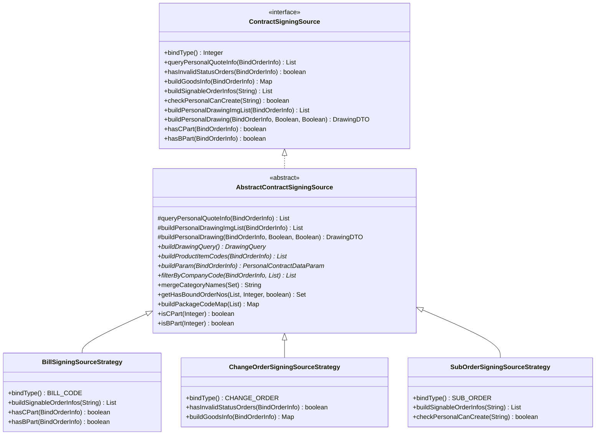
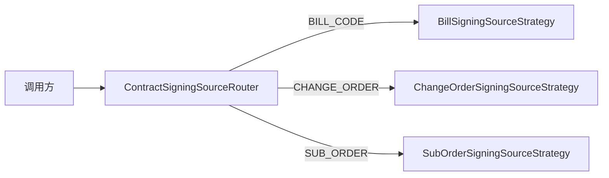
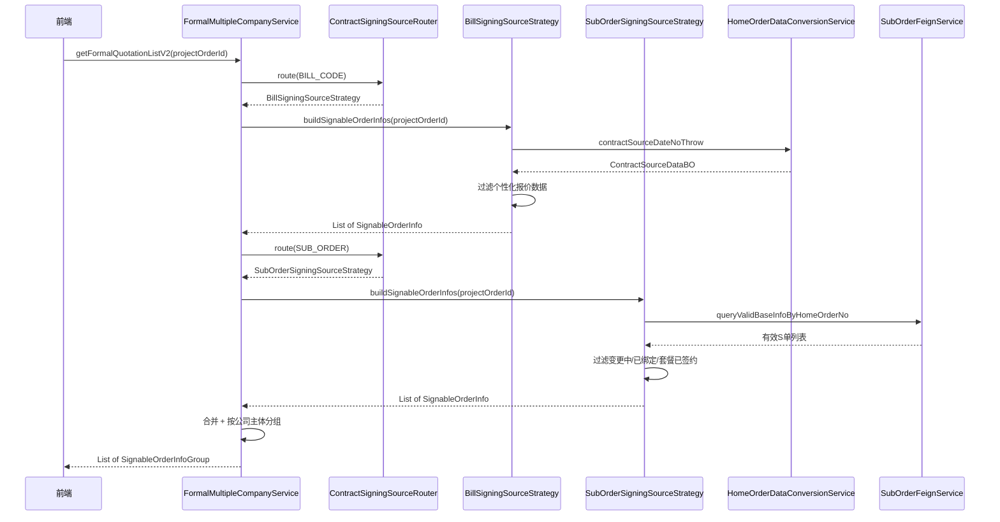
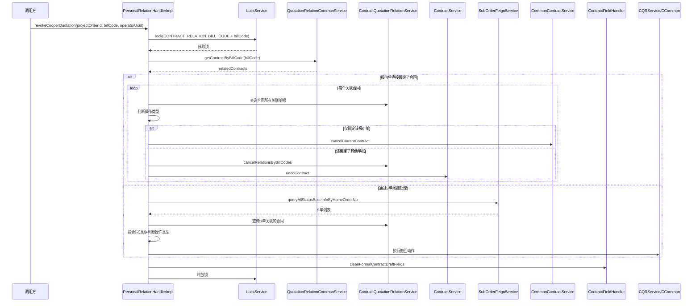

# Personal 模块 — 个性化合同签约与关联管理

## 1. 模块概述

`personal` 模块是销售合同系统中负责**个性化合同（C 报价单/变更单/S 单）签约发起与合同关联关系管理**的核心子模块。它解决了以下业务问题：

- **多主体签约**：一个项目订单下可能存在多个分公司主体的报价单，需要分别发起个性化合同
- **多来源签约**：签约数据来源包括报价单（Bill Code）、变更单（Change Order）、S 单（Sub Order）三种类型，各自有不同的数据获取和校验逻辑
- **关联关系撤回**：当协同报价单被撤回时，需要智能判断是作废合同还是仅解除关联并回退合同状态

模块位于包路径 `com.ke.utopia.nrs.salesproject.service.contract.v2.personal`。

## 2. 架构总览



## 3. 核心组件详解

### 3.1 FormalMultipleCompanyService — 正签多主体服务

**职责**：在正签发起阶段，收集并组装所有可选择的 C 报价单信息，按分公司主体分组返回给前端供用户选择。

**核心方法**：

| 方法 | 说明 |
|------|------|
| `getFormalQuotationListV2` | **主入口**（V2 版本）。先通过路由获取可签约报价单据（Bill Code 类型），再获取 S 单据，最后按公司主体分组返回 `SignableOrderInfoGroup` |
| `getFormalQuotationList` | **已废弃**。旧版入口，逻辑类似但返回格式不同 |
| `getFormalQuotationInfoList` | **已废弃**。获取基础报价内的 C 报价信息，区分整装/个性化/团装等业务类型 |
| `getCooperQuoteInfoList` | 获取协同报价单信息，过滤已取消、不支持签约、已绑定其他合同的报价单 |
| `getNotSupportSignBillCodeList` | 查询不允许签约的变更协同报价单（状态非"待签约"/"已完成"的变更单） |

**V2 版本数据流**：



**关键业务规则**：
- 受 Apollo 配置开关 `openFormalMultiple` 控制（V1 版本）
- 仅 V2.5 新流程（`isProcessV25New`）才走多主体逻辑
- 团装 2.5 场景下 S 单默认全部勾选（`mustSelect = true`）

### 3.2 PersonalRelationHandler / PersonalRelationHandlerImpl — 关联关系处理器

**职责**：处理协同报价单撤回时，合同与报价单/S 单的绑定关系清理，包含合同作废或状态回退。

**接口定义**：

```java
public interface PersonalRelationHandler {
    void revokeCooperQuotation(String projectOrderId, String billCode, Long operatorUcid);
}
```

**撤回流程决策树**：



**撤回动作枚举 `ContractRevocationAction`**：

| 动作 | 含义 | 触发条件 |
|------|------|---------|
| `CANCEL_CONTRACT` | 作废合同 | 合同仅绑定了当前要撤回的单据 |
| `UNBIND_AND_UNDO` | 解除关联并撤回合同 | 合同还绑定了其他有效单据 |
| `SKIP` | 跳过 | 合同处于无效/终态 |

**关键设计**：
- 使用分布式锁（`LockService`）保证协同报价单撤回与换绑操作的互斥性
- 撤回后自动清理正签草稿字段中的协同报价单号和 S 单号（`cleanFormalContractDraftFields`）
- 合同状态回退判断：非草稿且非终态时允许回退到草稿

### 3.3 ContractSigningSource — 签约来源策略体系

本模块采用**策略模式**统一处理三种签约数据来源（报价单、变更单、S 单），通过路由器分发请求。

#### 3.3.1 类层次结构



#### 3.3.2 ContractSigningSourceRouter — 路由器

路由器在初始化时收集所有 `ContractSigningSource` 实现（Spring 自动注入），按 `bindType()` 构建映射表。调用方通过 `route(bindType)` 获取对应策略。



#### 3.3.3 三种策略对比

| 维度 | BillSigningSourceStrategy | ChangeOrderSigningSourceStrategy | SubOrderSigningSourceStrategy |
|------|--------------------------|--------------------------------|------------------------------|
| **bindType** | `BILL_CODE` | `CHANGE_ORDER` | `SUB_ORDER` |
| **数据来源** | 正签报价单 + 协同报价单 | 变更单 | S 单（子订单） |
| **校验无效状态** | 查询报价单状态（调整中/删除/取消） | 查询变更流程状态（非待签约/已完成） | 查询 S 单状态是否在无效列表中 |
| **构建可签约单据** | 从基础报价中获取个性化报价数据 | 不支持（返回空） | 从主订单获取有效子单，过滤变更中/已绑定/套餐已签约的 S 单 |
| **图纸查询** | 按报价单商品行查询 | 按变更单商品行查询 + 临时状态 | 按 S 单商品行查询 |
| **C/B 部分判断** | 按报价单查询 SKU purchaseType | 按变更单查询 SKU purchaseType | 按 S 单商品行查询 purchaseType |
| **checkPersonalCanCreate** | 返回 false | 返回 false | 检查是否存在可签约 S 单（编辑场景不过滤草稿） |

#### 3.3.4 AbstractContractSigningSource — 模板方法基类

基类实现了 `ContractSigningSource` 接口中的通用逻辑，定义了若干模板方法由子类实现：

| 模板方法 | 说明 |
|---------|------|
| `buildParam` | 构建个性化报价查询参数 |
| `buildProductItemCodes` | 从单据中提取商品行唯一键 |
| `buildDrawingQuery` | 构造图纸查询参数 |
| `filterByCompanyCode` | 按单据号+主体过滤个性化报价数据 |

**通用能力**：
- `queryPersonalQuoteInfo`：统一的个性化报价查询流程（构建参数 → 查询 → 过滤）
- `buildPersonalDrawing`：统一的图纸获取流程（获取商品行 → 查询图纸 → 过滤个性化 PDF 图纸）
- `getHasBoundOrderNos`：查询已绑定有效合同的单据号，区分编辑场景和弹窗场景
- `mergeCategoryNames`：聚合类目名作为商品信息（最多取 3 个，第 3 个用"等"替代）

### 3.4 ProductQueryService — 商品查询服务

**职责**：封装从主订单协议数据中提取报价/变更商品信息的逻辑。

| 方法 | 说明 |
|------|------|
| `getQuotationProductDTOS` | 根据主单号 + 报价单号列表查询报价商品，从 HomeProject 协议中解析套餐和单品 |
| `getChangeQuotationProductDTOS` | 根据主单号 + 变更单号查询变更报价商品，结构类似但走变更报价通道 |

**数据解析路径**：
- 报价商品：`HomeProject → MainOrder → CostControl → QuotationModule → PersonalQuotation → ComboList / QuotationList`
- 变更商品：`HomeProject → MainOrder → CostControl → ChangeQuotationModule → PersonalQuotation → ComboList / QuotationList`

## 4. 依赖关系

### 4.1 外部 RPC 依赖

| RPC 服务 | 调用方 | 用途 |
|---------|--------|------|
| `HomeOrderDataConversionService` | FormalMultipleCompanyService, AbstractContractSigningSource | 主订单数据转换，获取个性化报价源数据 |
| `AtomBudgetRpc` | FormalMultipleCompanyService, BillStrategy, ChangeStrategy | 预算报价查询、变更单状态查询 |
| `AtomDrawingRpc` | AbstractContractSigningSource | 个性化图纸查询 |
| `MdmRpc` | FormalMultipleCompanyService, SubOrderStrategy | 分公司主数据查询 |
| `OrderStandardQueryRpc` | ProductQueryService | 主订单协议标准查询 |
| `SubOrderFeignService` | AbstractContractSigningSource, SubOrderStrategy, RelationHandler | S 单查询和状态管理 |
| `PackageQueryFeignService` | SubOrderStrategy | 套餐信息查询 |

### 4.2 内部 DAO 依赖

| DAO 服务 | 调用方 | 用途 |
|---------|--------|------|
| `ContractService` | RelationHandler, AbstractContractSigningSource | 合同 CRUD |
| `ContractQuotationRelationService` | RelationHandler, AbstractContractSigningSource, SubOrderStrategy | 报价单-合同关联关系管理 |
| `ContractRelationService` | RelationHandler | 合同间关联关系（正签与个性化） |
| `ContractRelationHandler` | FormalMultipleCompanyService | 合同字段处理 |

### 4.3 内部服务依赖

| 服务 | 调用方 | 用途 |
|------|--------|------|
| `CommonBusinessService` | FormalMultipleCompanyService, BillStrategy, SubOrderStrategy | 通用业务判断（V2.5 流程、团装、业务类型） |
| `QuotationRelationCommonService` | FormalMultipleCompanyService, RelationHandler | 报价关联关系通用查询 |
| `CommonContractService` | RelationHandler | 合同作废等通用操作 |
| `HomeAndPcCommonService` | RelationHandler | 合同状态回退 |
| `LockService` | RelationHandler | 分布式锁 |
| `ContractBindLogService` | RelationHandler | 合同解绑日志记录 |
| `ContractApolloConfig` | FormalMultipleCompanyService | Apollo 配置开关 |
| `ContractDependentDataService` | FormalMultipleCompanyService, BillStrategy | 合同依赖数据服务 |

## 5. 数据流

### 5.1 正签发起数据流



### 5.2 协同报价单撤回数据流



## 6. 关键设计模式

### 6.1 策略模式（Strategy Pattern）

签约来源通过 `ContractSigningSource` 接口定义统一契约，三种策略实现各自的数据获取和校验逻辑。`ContractSigningSourceRouter` 作为路由器，通过 `bindType` 分发到具体策略。此设计使得新增签约来源类型只需添加新的策略实现类，无需修改调用方代码。

### 6.2 模板方法模式（Template Method Pattern）

`AbstractContractSigningSource` 定义了签约来源的通用流程（参数构建 → 数据查询 → 主体过滤 → 图纸获取），将差异化的步骤（`buildParam`、`buildProductItemCodes`、`filterByCompanyCode`、`buildDrawingQuery`）留给子类实现。

### 6.3 策略枚举决策（Strategy Enum for Decision）

`PersonalRelationHandlerImpl` 内部使用 `ContractRevocationAction` 枚举表示撤回决策结果，将"判断"与"执行"分离：
- `determineRevocationAction*` 方法只负责判断应执行哪种操作
- `executeRevocationAction` 方法根据枚举值执行具体操作

这种分离使得决策逻辑可独立测试，且便于扩展新的撤回类型。

### 6.4 分布式锁保护

协同报价单撤回与换绑操作使用 `LockService` 加锁互斥（锁粒度为 `CONTRACT_RELATION_BILL_CODE + billCode`），防止并发操作导致数据不一致。

## 7. 业务类型处理矩阵

不同业务类型对个性化报价数据的处理方式有所不同：

| 业务类型 | 整装（REFORM_ALL） | 团装（GROUP_DECORATE） | 房证（HOUSE_CERTIFICATE） | 默认 |
|---------|-------------------|---------------------|------------------------|------|
| **正签C报价** | 有个性化数据时使用 PersonalContractData | 使用 PersonalContractData（需 groupPersonalForFormal 校验） | 有个性化数据时使用 PersonalContractData | 使用套外个性化报价单 |
| **可签约S单** | 正常获取 | S 单默认 mustSelect=true | 正常获取 | 正常获取 |
| **协同报价过滤** | 过滤不同分公司 | 不返回协同报价 | 过滤不同分公司 | 正常返回 |

## 8. 注意事项与风险点

1. **废弃方法兼容**：`getFormalQuotationList`、`getFormalQuotationInfoList` 标记为 `@Deprecated`，但 V1 逻辑仍保留以兼容旧流程
2. **锁超时**：撤回操作使用 10 秒锁超时，若业务处理时间过长可能导致锁提前释放
3. **套餐关联过滤**：S 单签约时需过滤同套餐下已有子单签约的场景，避免同套餐重复签约
4. **状态判断复杂性**：合同撤回涉及多种状态组合判断（无效态/终态/已确认申请用章等），需关注 `ContractStatusEnum` 的状态定义变化
