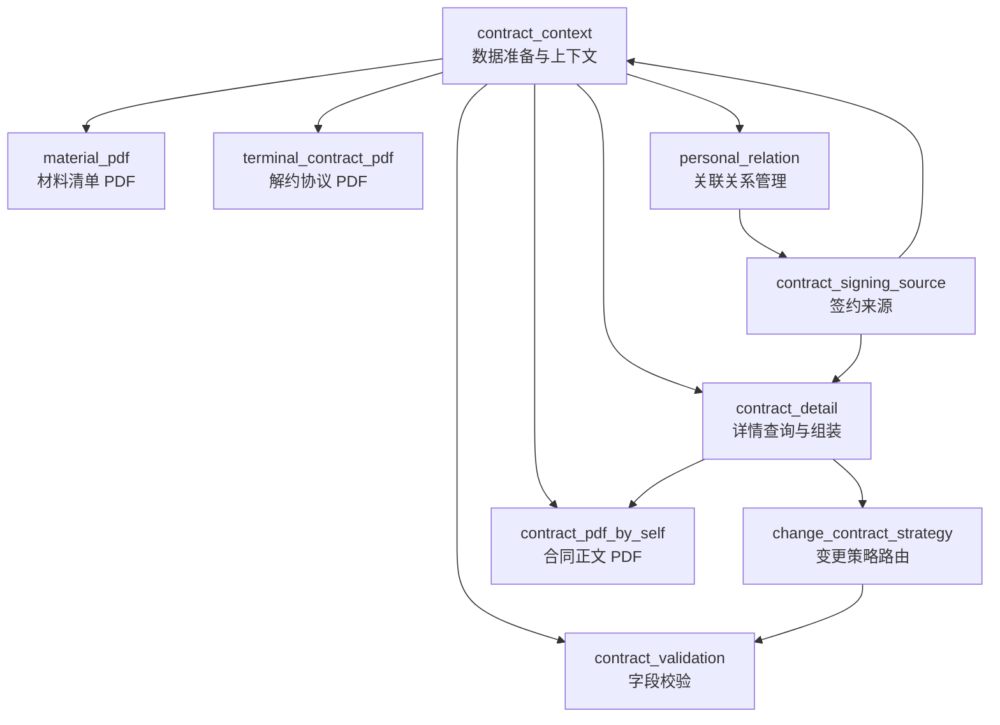

# V2 合同子系统概览

## 1. 仓库目的

V2 合同子系统是家装销售项目中的**合同全生命周期管理模块**，覆盖从合同创建、签约、变更到解约的完整业务闭环。系统针对家装行业的多维度业务场景（整装、团装、翻新全案、个性化等），提供：

- **数据预加载与上下文管理**：通过 AOP 切面 + ThreadLocal 机制，在合同操作前自动并行加载多源异构数据
- **合同详情查询与组装**：支持首屏优化的分屏加载策略，组装十余个子模块的完整合同详情
- **变更合同策略路由**：基于策略模式，按合同类型（套餐变更 / 设计变更）分发不同的校验、提交、差异计算逻辑
- **多业务类型 PDF 生成**：为图纸合同、团装合同、翻新全案合同、材料清单、解约协议等生成对应的 PDF 文档
- **个性化合同签约来源管理**：抽象报价单、变更单、子单三种签约数据源，统一状态校验与商品信息构建
- **字段校验**：通过反射调度 + 配置驱动，对品类、金额、身份证、企业信息等进行规则校验

---

## 2. 端到端架构

```mermaid
graph TD
    subgraph Entry[请求入口层]
        CTRL[ContractController<br/>合同保存/提交/查询/变更/解约]
    end

    subgraph ContextLayer[数据准备层 - contract_context]
        ASPECT[ContractContextAspect<br/>AOP 切面]
        DETAIL_ASPECT[ContractDetailAspect<br/>详情切面]
        CTX_HANDLER[ContractContextHandler<br/>ThreadLocal 上下文]
        DETAIL_HANDLER[ContractDetailContextHandler<br/>详情上下文]
        PARALLEL[ParallelTaskService<br/>9路并行数据加载]
    end

    subgraph StrategyLayer[变更策略层 - change_contract_strategy]
        FACTORY[ChangeContractStrategyFactory]
        NORMAL[NormalChangeContractStrategy<br/>设计变更]
        ZQ[ZQChangeContractStrategy<br/>套餐变更]
    end

    subgraph DetailLayer[详情组装层 - contract_detail]
        DETAIL_SVC[ContractDetailService<br/>12+ 子模块组装]
    end

    subgraph ValidationLayer[校验层 - contract_validation]
        FIELD_CHECK[ContractFieldCheckService<br/>反射调度 + 配置驱动]
        WORKER_CHECK[WorkerTypeCheckService<br/>工种身份校验]
    end

    subgraph SignSourceLayer[签约来源层 - contract_signing_source]
        SIGN_SRC[ContractSigningSource 接口]
        BILL[BillSigningSourceStrategy<br/>报价单]
        CHANGE_ORDER[ChangeOrderSigningSourceStrategy<br/>变更单]
        SUB_ORDER[SubOrderSigningSourceStrategy<br/>子单]
    end

    subgraph PDFFormatLayer[PDF 生成层]
        PDF_SELF[contract_pdf_by_self<br/>合同正文 PDF]
        MAT_PDF[material_pdf<br/>材料清单 PDF]
        TERM_PDF[terminal_contract_pdf<br/>解约协议 PDF]
    end

    subgraph RelationLayer[关联关系层 - personal_relation]
        REL_HANDLER[PersonalRelationHandlerImpl<br/>报价单撤回 / 合同解绑]
    end

    subgraph External[外部依赖]
        RPC[远程 RPC 服务<br/>报价/图纸/审核/款项/套餐/订单]
        S3[S3 文件存储]
        FREEFORM[FreeForm 协议平台]
        APOLLO[Apollo 配置中心]
        DB[(MySQL 数据库)]
    end

    CTRL --> ASPECT
    CTRL --> DETAIL_ASPECT
    ASPECT --> CTX_HANDLER
    ASPECT --> PARALLEL
    DETAIL_ASPECT --> DETAIL_HANDLER
    DETAIL_ASPECT --> PARALLEL

    PARALLEL --> RPC

    CTX_HANDLER --> FIELD_CHECK
    CTX_HANDLER --> DETAIL_SVC
    CTX_HANDLER --> PDF_SELF
    CTX_HANDLER --> MAT_PDF
    CTX_HANDLER --> TERM_PDF
    DETAIL_HANDLER --> DETAIL_SVC

    CTRL --> FACTORY
    FACTORY --> NORMAL
    FACTORY --> ZQ

    CTRL --> SIGN_SRC
    SIGN_SRC --> BILL
    SIGN_SRC --> CHANGE_ORDER
    SIGN_SRC --> SUB_ORDER

    PDF_SELF --> S3
    PDF_SELF --> FREEFORM
    MAT_PDF --> S3
    TERM_PDF --> RPC

    CTRL --> REL_HANDLER
    REL_HANDLER --> DB

    DETAIL_SVC --> RPC
    FIELD_CHECK --> RPC
    FIELD_CHECK --> APOLLO
```

---

## 3. 模块索引

| 模块 | 路径 | 职责 | 详细文档 |
|------|------|------|---------|
| **contract_context** | `contract/aspect` | AOP 切面 + ThreadLocal 上下文，在合同操作前并行加载 9 路数据 | [contract_context.md](docs/contract_context.md) |
| **contract_detail** | `contract/aspect` | 合同详情查询与组装，首屏优化加载策略，12+ 子模块详情构建 | [contract_detail.md](docs/contract_detail.md) |
| **change_contract_strategy** | `contract/changecontractstrategey` | 变更合同策略路由（设计变更 vs 套餐变更），7 阶段生命周期接口 | [change_contract_strategy.md](docs/change_contract_strategy.md) |
| **contract_validation** | `contract` | 字段校验层，反射调度 + Apollo 配置驱动，覆盖品类/金额/身份/企业校验 | [contract_validation.md](docs/contract_validation.md) |
| **contract_pdf_by_self** | `contract/createcontractpdfbyself` | 合同正文 PDF 生成（图纸/团装/翻新全案），策略模式 + 模板方法 | [contract_pdf_by_self.md](docs/contract_pdf_by_self.md) |
| **material_pdf** | `contract/combo/material/pdf` | 材料配送清单 PDF 生成与数据一致性检查 | [material_pdf.md](docs/material_pdf.md) |
| **terminal_contract_pdf** | `contract` | 解约协议 PDF 数据填充与生成，含退款渠道与金额格式化 | [terminal_contract_pdf.md](docs/terminal_contract_pdf.md) |
| **contract_signing_source** | `contract/personal/bind` | 个性化签约数据源抽象（报价单/变更单/子单），策略模式 + 模板方法 | [contract_signing_source.md](docs/contract_signing_source.md) |
| **personal_relation** | `contract/personal` | 个性化合同关联关系管理，报价单撤回时的合同解绑与状态回退 | [personal_relation.md](docs/personal_relation.md) |

---

## 4. 模块间依赖关系

**核心依赖方向**：`contract_context` 是整个子系统的数据基座，几乎所有模块都依赖其提供的 ThreadLocal 上下文数据。`contract_signing_source` 为上下文装配和详情查询提供签约数据源抽象，`personal_relation` 则处理合同绑定关系的解除，与 `contract_signing_source`（绑定方向）形成完整的生命周期闭环。

---

## 5. 关键设计模式

| 设计模式 | 应用模块 | 说明 |
|---------|---------|------|
| **AOP + ThreadLocal** | contract_context, contract_detail | 注解驱动的数据预加载，业务代码零侵入 |
| **并行任务编排** | contract_context, contract_detail | `ParallelTaskService` 实现多路并行 RPC 调用，总耗时 ≈ 最慢单路 |
| **策略模式** | change_contract_strategy, contract_pdf_by_self, contract_signing_source | 按合同类型/业务类型/单据类型路由到不同实现 |
| **模板方法模式** | contract_pdf_by_self, contract_signing_source | 基类封装通用骨架，子类插入差异化逻辑 |
| **工厂模式** | change_contract_strategy, contract_pdf_by_self | Spring IoC 自动发现 + 枚举映射路由 |
| **反射调度** | contract_validation | 方法名字符串动态分发校验规则 |
| **分布式锁** | personal_relation | 按报价单号加锁，保证撤回操作串行 |