# personal_relation 模块 — 个性化合同关联关系处理

## 1. 模块概述

`personal_relation` 模块是销售合同系统中**个性化合同**场景的核心关联关系管理模块。它负责在协同报价单被撤回时，维护合同与报价单（BillCode）、S 单（SubOrder）之间的绑定关系，并根据业务规则决定是**作废合同**还是**解除关联并撤回合同**。

该模块是合同生命周期管理的关键组成部分，确保在上游业务变更（报价单撤回）发生时，下游合同状态能够正确、一致地流转。

### 核心职责

| 职责 | 说明 |
|------|------|
| 协同报价单撤回处理 | 当协同报价单被撤回时，正确处理其与合同的绑定关系 |
| 双路径解绑 | 支持直接绑定（报价单↔合同）和间接绑定（报价单→S单→合同）两条解绑路径 |
| 合同状态回退 | 根据绑定情况决定作废合同或回退合同状态至草稿 |
| 正签草稿清理 | 解绑后清理关联正签草稿合同中的字段引用 |

---

## 2. 架构总览

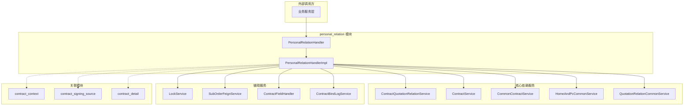

---

## 3. 核心组件详解

### 3.1 PersonalRelationHandler（接口）

定义了个性化合同关联关系处理的统一入口，目前包含一个核心方法：

| 方法 | 签名 | 说明 |
|------|------|------|
| `revokeCooperQuotation` | `(String projectOrderId, String billCode, Long operatorUcid) → void` | 撤回协同报价单，处理合同与报价单/S单的绑定关系 |

接口设计遵循**门面模式**，将复杂的内部解绑逻辑对外隐藏，调用方只需传入项目订单 ID、报价单号和操作人信息即可。

### 3.2 PersonalRelationHandlerImpl（实现类）

实现类是整个模块的核心，包含完整的业务逻辑。以下是关键内部结构：

#### 3.2.1 核心操作枚举

```java
private enum ContractRevocationAction {
    CANCEL_CONTRACT,    // 作废合同
    UNBIND_AND_UNDO,    // 解除关联并撤回合同
    SKIP                // 跳过处理
}
```

#### 3.2.2 依赖注入

| 依赖服务 | 用途 |
|----------|------|
| `ContractService` | 合同基础 CRUD 操作 |
| `CommonContractService` | 合同通用业务逻辑（作废合同等） |
| `QuotationRelationCommonService` | 报价单关联查询 |
| `ContractQuotationRelationService` | 合同-报价单关联关系管理 |
| `HomeAndPcCommonService` | 合同状态回退操作 |
| `ContractRelationService` | 合同关联关系查询（正签草稿） |
| `ContractFieldHandler` | 合同字段清理操作 |
| `SubOrderFeignService` | S 单远程查询（RPC） |
| `LockService` | 分布式锁服务 |
| `ContractBindLogService` | 解绑日志记录 |

---

## 4. 数据流与业务流程

### 4.1 撤回协同报价单主流程

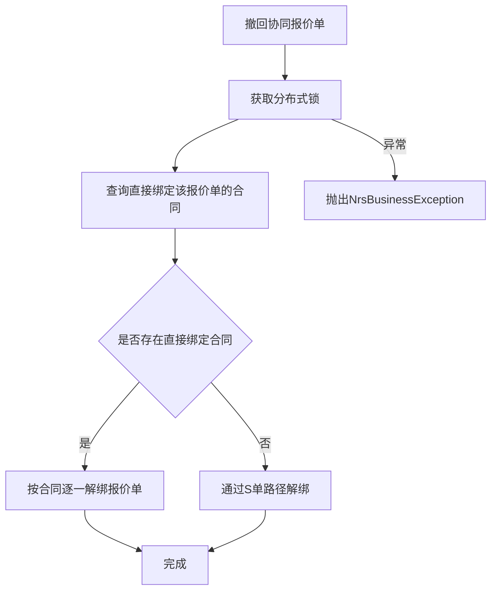

### 4.2 直接绑定路径详解

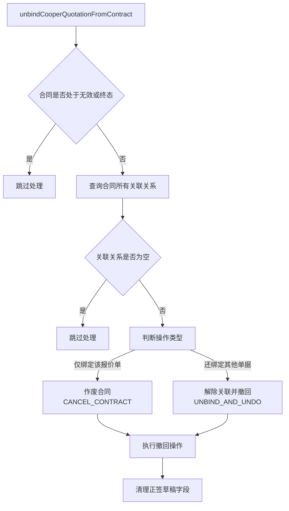

### 4.3 S 单间接绑定路径详解

当协同报价单未直接绑定合同时，说明报价单已下单转换为 S 单，合同已从报价单换绑到 S 单：

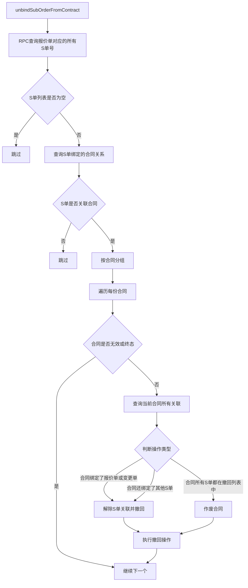

### 4.4 S 单路径的策略判断逻辑

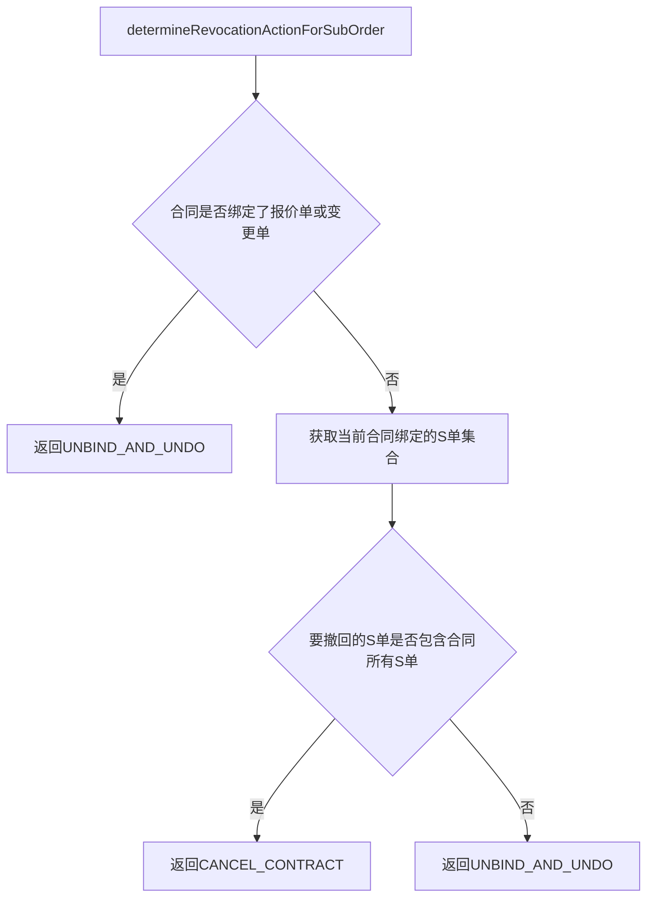

---

## 5. 执行撤回操作的详细行为

### 5.1 作废合同（CANCEL_CONTRACT）

当合同仅绑定了当前要撤回的报价单（或 S 单），且没有其他单据关联时：

1. 调用 `CommonContractService.cancelCurrentContract()` 作废合同
2. 清理正签草稿字段

### 5.2 解除关联并撤回（UNBIND_AND_UNDO）

当合同绑定了其他单据（报价单、变更单或其他 S 单）时：

1. 收集所有需要解绑的单据编号（报价单号 + S 单号列表）
2. 调用 `ContractQuotationRelationService.cancelRelationsByBillCodes()` 解除关联关系
3. 通过 `ContractBindLogService.recordUnbindLog()` 记录解绑日志
4. 若合同状态允许，调用 `HomeAndPcCommonService.undoContract()` 将合同回退至草稿状态
5. 清理正签草稿字段

### 5.3 合同状态判断

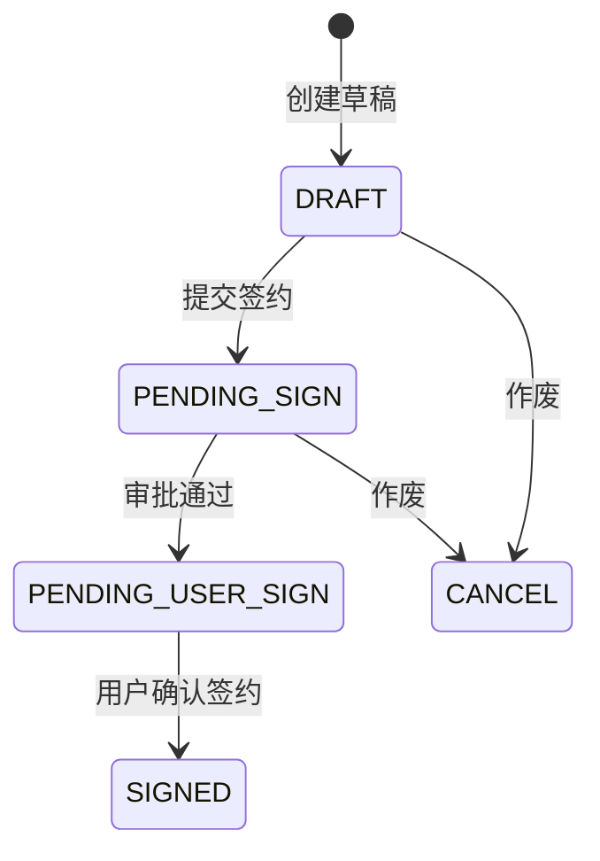

合同终态和无效态说明（`isContractInInvalidOrFinalStatus` 方法判断）：

| 状态 | 含义 | 是否视为终态/无效态 |
|------|------|-------------------|
| CANCEL | 已作废 | 是 |
| SIGNED | 已签约终态 | 是 |
| PENDING_USER_SIGN + userConfirmStatus=YES | 待用户签约且已确认 | 是 |
| PENDING_USER_SIGN + userConfirmStatus!=YES | 待用户签约未确认 | 否，仍可执行解绑 |

---

## 6. 并发控制

模块通过 `LockService` 实现分布式锁，防止并发操作导致数据不一致：

- **锁 Key**：`CONTRACT_RELATION_BILL_CODE + cooperBillCode`
- **锁粒度**：按协同报价单号加锁
- **超时时间**：10000ms
- **异常处理**：锁获取失败时抛出 `NrsBusinessException`

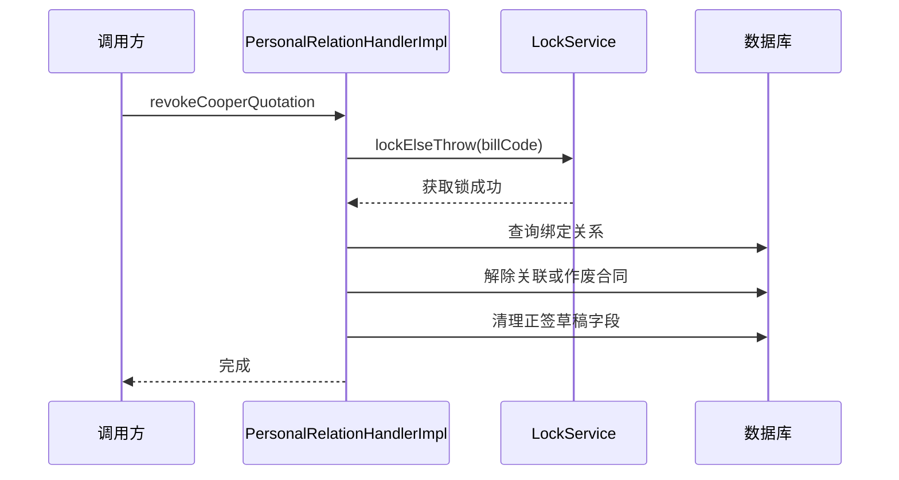

---

## 7. 模块间关系

### 7.1 与 contract_signing_source 模块的关系

[contract_signing_source](contract_signing_source.md) 模块定义了三种签约数据来源策略（`BillSigningSourceStrategy`、`SubOrderSigningSourceStrategy`、`ChangeOrderSigningSourceStrategy`），负责构建合同与报价单/S 单/变更单的**绑定**关系。而 `personal_relation` 模块负责在绑定关系需要**解除**时进行处理。

两者形成完整的生命周期闭环：

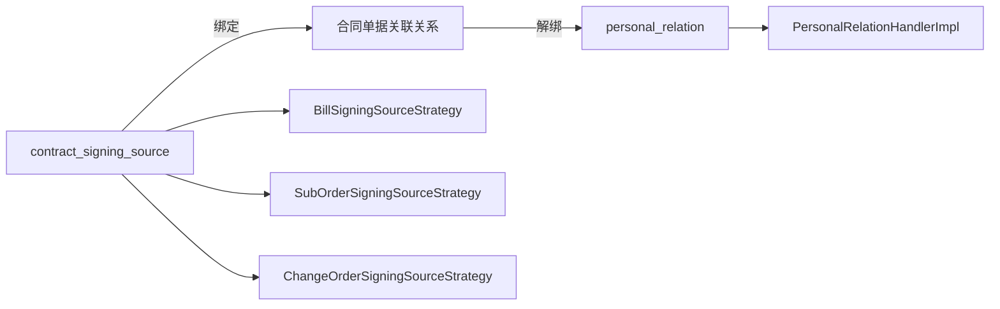

### 7.2 与 contract_context 模块的关系

[contract_context](contract_context.md) 模块通过 `ContractContextAspect` 在合同操作前构建上下文（项目信息、报价信息、公司信息等），为 `personal_relation` 模块提供必要的数据环境。`ContractContextHandler` 提供的上下文数据被多个依赖服务间接使用。

### 7.3 与 contract_detail 模块的关系

[contract_detail](contract_detail.md) 模块处理合同详情的查询与展示。当 `personal_relation` 模块执行解绑操作导致合同状态变更后，`contract_detail` 模块查询到的合同详情将反映最新状态。

### 7.4 与 change_contract_strategy 模块的关系

[change_contract_strategy](change_contract_strategy.md) 模块通过策略模式管理不同类型的变更合同流程。在 S 单路径中，`PersonalRelationHandlerImpl` 需要判断合同是否绑定了变更单（`BindTypeEnum.CHANGE_ORDER`），这与变更合同策略的绑定逻辑紧密相关。

### 7.5 与 contract_validation 模块的关系

[contract_validation](contract_validation.md) 模块在合同提交前进行字段校验。`personal_relation` 模块的解绑操作发生在合同生命周期的另一端（解绑/作废），两者不直接调用但共同维护合同数据的完整性。

---

## 8. 关键设计模式

### 8.1 门面模式（Facade）

`PersonalRelationHandler` 接口对外屏蔽了复杂的内部解绑逻辑，调用方只需调用 `revokeCooperQuotation()` 一个方法即可完成整个撤回流程。

### 8.2 分布式锁

使用 `LockService.lockElseThrow()` 保证同一报价单的撤回操作串行执行，避免并发问题。锁的粒度精确到报价单级别，最小化锁竞争。

### 8.3 策略模式（隐式）

虽然未显式使用策略模式，但 `ContractRevocationAction` 枚举配合 `executeRevocationAction()` 方法实现了类似的效果——根据不同的业务判断结果执行不同的撤回操作。

### 8.4 防御性编程

- **状态前置检查**：在执行任何操作前先判断合同状态，避免对无效/终态合同执行无意义的操作
- **空值保护**：对查询结果进行非空判断后才执行后续逻辑
- **异常封装**：将内部异常包装为业务异常，提供友好的错误信息

---

## 9. 核心流程总结

### 9.1 整体决策流程

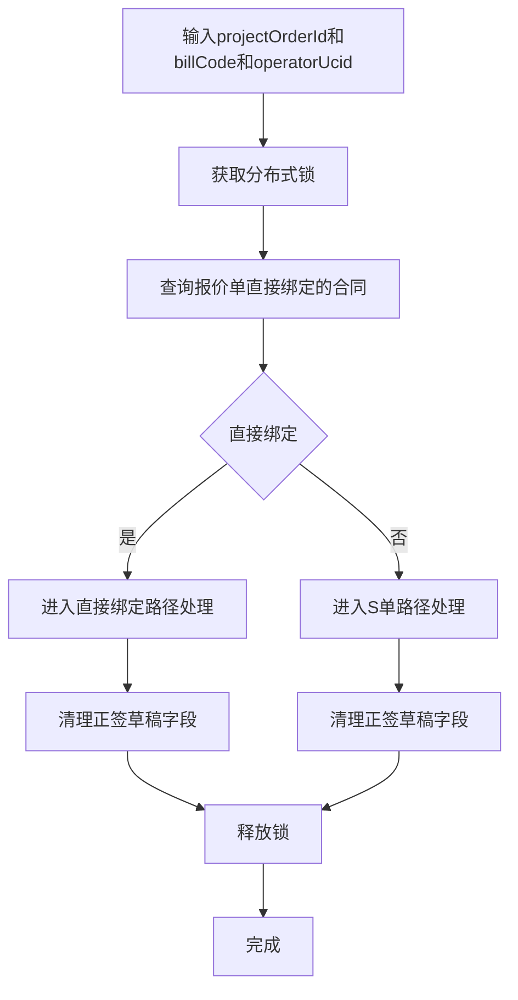

### 9.2 直接绑定路径

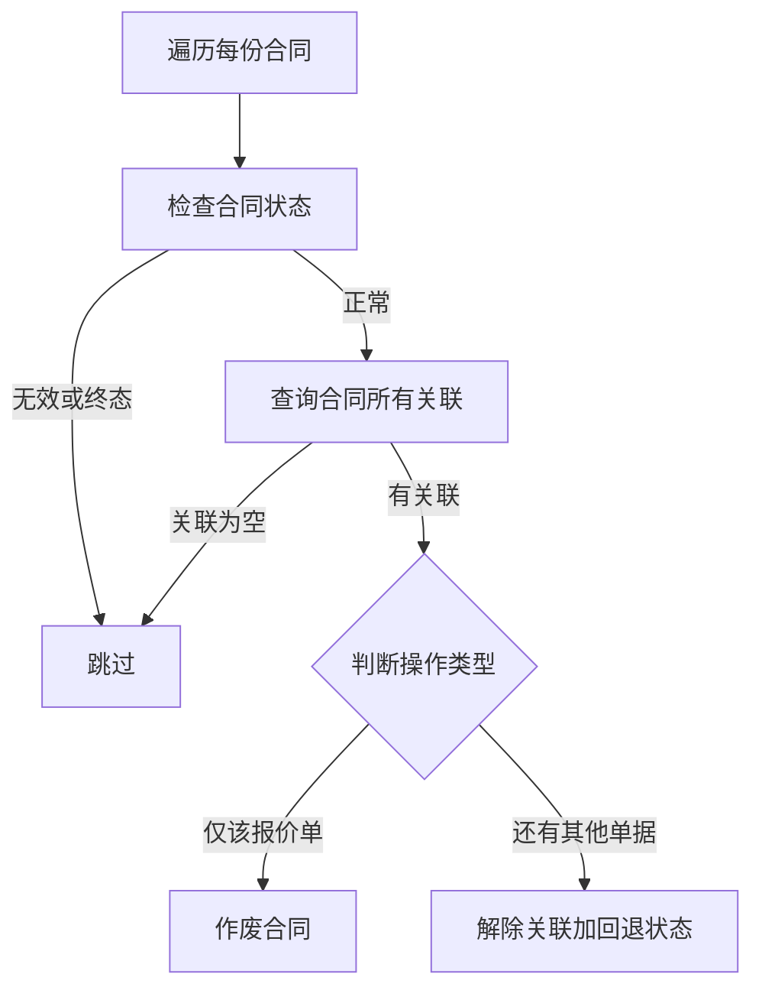

### 9.3 S 单间接路径

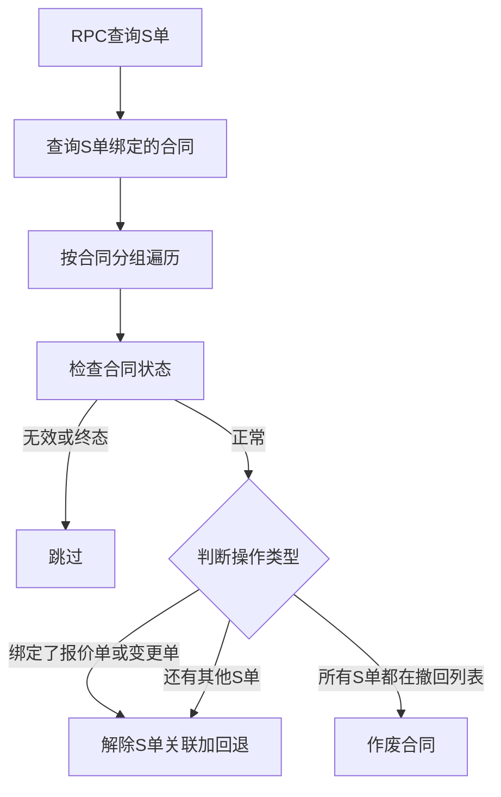

---

## 10. 涉及的数据表

| 表/实体 | 用途 |
|---------|------|
| `Contract` | 合同主表，存储合同状态、合同编号等 |
| `ContractQuotationRelation` | 合同-报价单关联关系表，存储绑定类型、绑定状态、单据编号 |
| `ContractRelation` | 合同间关联关系表（正签↔草稿） |
| `ContractField` | 合同扩展字段表（需清理的报价单号、S 单号存储于此） |

---

## 11. 注意事项

1. **锁粒度**：以协同报价单号为粒度加锁，同一报价单的撤回操作严格串行
2. **S 单路径的隐含逻辑**：当报价单未直接绑定合同时，模块假设报价单已下单转换为 S 单，合同已换绑到 S 单——这是业务流程中的隐含假设
3. **状态判断的边界条件**：`PENDING_USER_SIGN` 状态下只有用户已确认签约的才视为终态，未确认的仍可执行解绑
4. **正签草稿清理**：解绑后需要同步清理关联的正签草稿合同中的报价单号和 S 单号字段，否则会导致正签草稿数据残留
5. **日志审计**：所有解绑操作通过 `ContractBindLogService` 记录操作日志，便于问题排查
