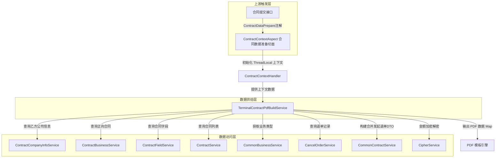
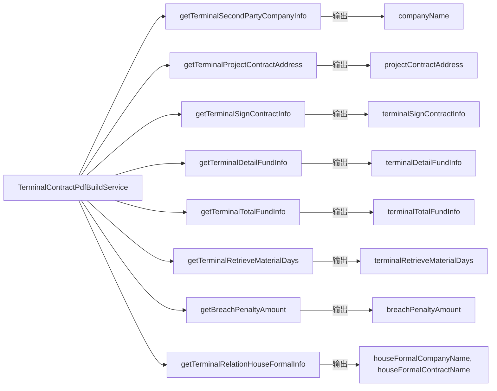
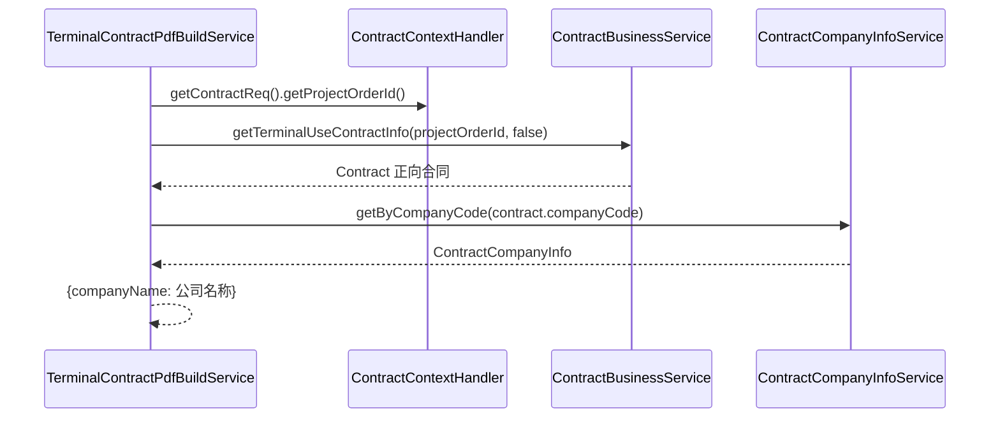
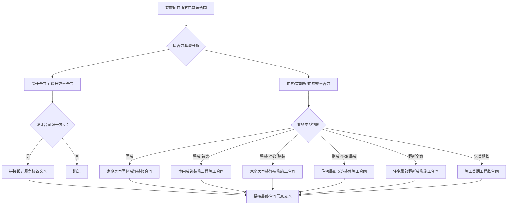
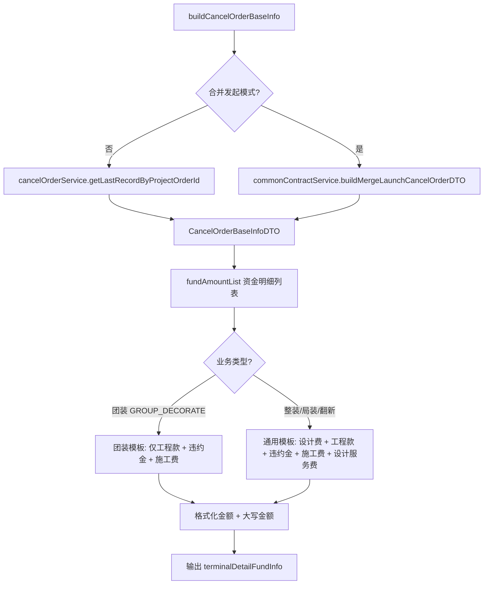
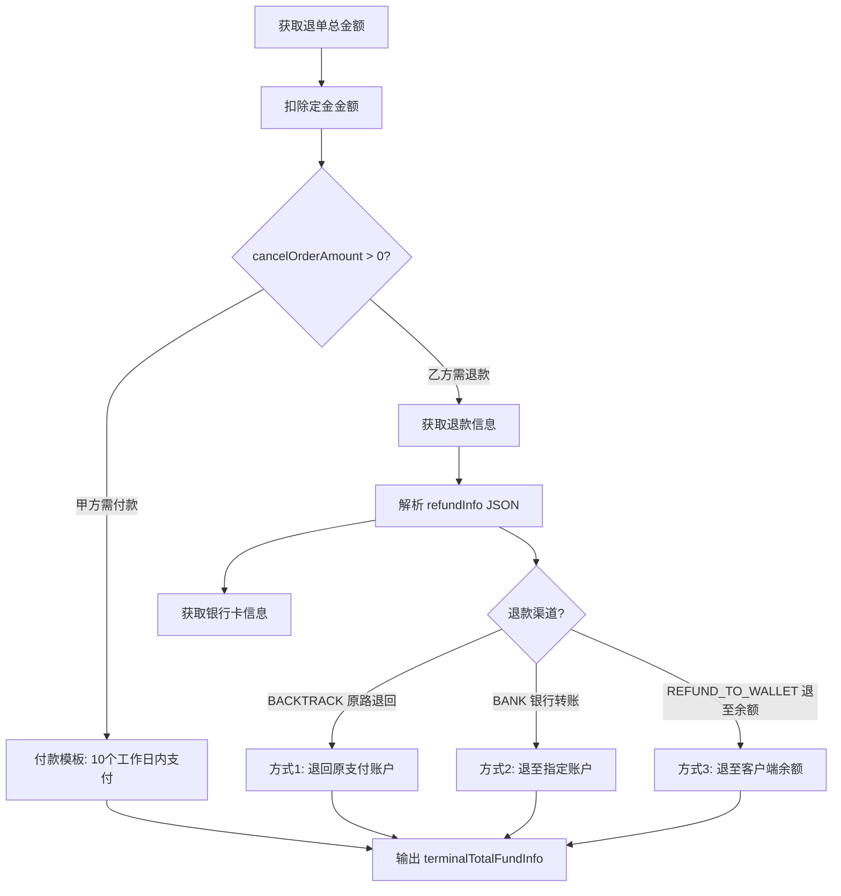
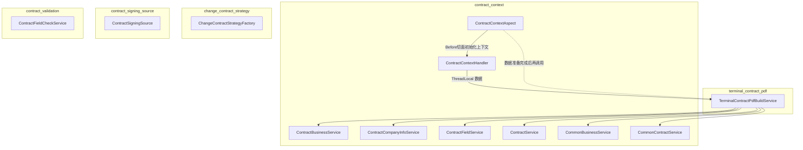
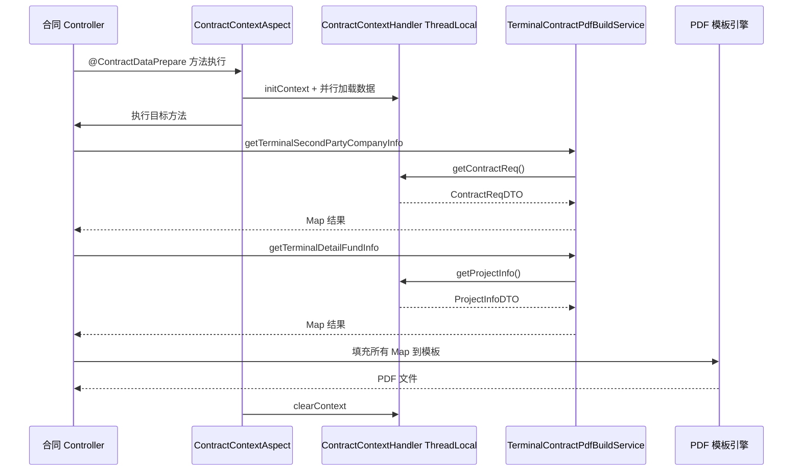
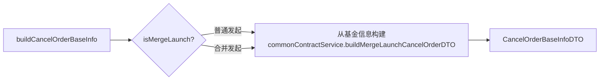

# Terminal Contract PDF 模块 — 解约协议 PDF 生成服务

## 模块概述

`terminal_contract_pdf` 模块负责**解约协议 PDF 的数据填充与生成**。当客户发起家装项目退单（解约）时，系统需要生成一份正式的解约协议 PDF 文档，包含乙方公司信息、房屋地址、关联已签署合同、款项明细、保密违约金等关键条款内容。

该模块的核心类 `TerminalContractPdfBuildService` 是一个 Spring `@Component`，它不直接负责 PDF 的渲染（如 iText/pdfbox），而是作为 **PDF 数据供给层**，将各项业务字段以 `Map<String, Object>` 形式输出，供上游 PDF 模板引擎（如 FreeMarker）填充到解约协议模板中。

## 架构总览

## 核心组件详解

### TerminalContractPdfBuildService

**职责**：解约协议 PDF 各项数据段的构建与格式化，是本模块唯一的核心组件。

**依赖注入的服务列表**：

| 依赖服务 | 来源模块 | 用途 |
|---------|---------|------|
| `ContractCompanyInfoService` | [contract_context](contract_context.md) | 查询乙方（装修公司）公司信息 |
| `ContractBusinessService` | [contract_context](contract_context.md) | 获取解约协议关联的正向合同信息 |
| `ContractFieldService` | [contract_context](contract_context.md) | 查询合同自定义字段（地址、区域等） |
| `ContractService` | [contract_context](contract_context.md) | 获取已签署合同列表 |
| `CommonBusinessService` | [contract_context](contract_context.md) | 获取业务类型、小程序类型等公共业务逻辑 |
| `CancelOrderService` | [contract_context](contract_context.md) | 查询最新退单记录（含资金明细） |
| `CommonContractService` | [contract_context](contract_context.md) | 获取公司信息、构建合并发起退单 DTO |
| `CipherService` | [contract_context](contract_context.md) | 银行卡号等敏感信息解密 |

**上下文依赖**：本服务大量依赖 `ContractContextHandler` 提供的 `ThreadLocal` 上下文，详见 [contract_context](contract_context.md) 模块文档。

## 公开方法清单

本服务对外暴露以下数据构建方法，每个方法返回 `Map<String, Object>`，键为 PDF 模板中的变量名：

## 数据流与处理逻辑

### 1. 乙方公司信息 (`getTerminalSecondPartyCompanyInfo`)

通过项目订单号找到对应的正向签约合同，再根据公司编码查询公司全称。

### 2. 房屋地址 (`getTerminalProjectContractAddress`)

从正向合同的自定义字段中拼接完整地址：`城市-区域-小区-楼栋-单元-楼层-门牌号`。地址各层级通过 `ContractField` 的 `fieldKey` 提取，城市名称通过 `CityEnum` 枚举转换。

### 3. 已签署合同信息 (`getTerminalSignContractInfo`)

合同名称根据**业务类型**和**小程序渠道**（被窝 vs 圣都）动态选择，这是解约协议中引用原始协议的关键段落。

### 4. 款项明细 (`getTerminalDetailFundInfo`)

根据**退单资金数据**生成已支付金额、违约金、实际已发生费用的明细文本。

关键差异：
- **团装**：只涉及工程款，不区分设计费
- **整装/局装/翻新**：分别列出设计服务费和工程款

资金类型通过 `FundTypeEnum` 枚举区分：`DESIGN_CHARGE`（设计费）、`PROJECT_CHARGE`（工程款）、`LIQUIDATED_DAMAGES`（违约金）。

### 5. 总款项信息 (`getTerminalTotalFundInfo`)

退款渠道通过 `RefundChannelEnum` 枚举区分，退款模板包含三种方式：
1. **原路退回**：微信/支付宝/理房通原支付账户
2. **指定银行账户**：需提供开户行、户名、账号
3. **客户端余额**：可消费或提现

银行账号通过 `CipherService.decrypt()` 解密后展示。

### 6. 其他条款字段

| 方法 | 输出字段 | 数据来源 | 说明 |
|------|---------|---------|------|
| `getTerminalRetrieveMaterialDays` | `terminalRetrieveMaterialDays` | `ContractProjectInfoReq` | 已开工时乙方可取回剩余施工材料的天数，默认"/" |
| `getBreachPenaltyAmount` | `breachPenaltyAmount` | `ContractProjectInfoReq` | 保密义务违约金金额，默认"/" |
| `getTerminalRelationHouseFormalInfo` | `houseFormalCompanyName`, `houseFormalContractName` | 合并发起的合同列表 | 仅合并发起模式下填充家装正签合同信息 |

## 模块间依赖关系

> **注**：`TerminalContractPdfBuildService` 不直接依赖 `change_contract_strategy`、`contract_signing_source`、`contract_validation` 等模块。这些模块在合同提交、变更等流程中使用，而解约协议 PDF 生成是独立的数据填充步骤。

## 关键设计模式

### 1. ThreadLocal 上下文模式

`TerminalContractPdfBuildService` 的所有方法都通过 `ContractContextHandler.getContractReq()` 获取上下文数据，而非通过方法参数传入。这种设计：

- **优势**：方法签名简洁，多个 PDF 字段构建方法共享同一上下文，无需层层传参
- **前提**：调用前必须由 `ContractContextAspect`（AOP 切面）初始化上下文，方法执行完毕后切面自动清理

### 2. 合并发起 vs 普通发起的分支处理

解约协议的退单数据来源有两种路径：

- **普通发起**：用户先有退单操作，解约协议关联已有的退单记录
- **合并发起**：解约协议与正向合同同时发起，退单数据需要从基金信息中临时构建

### 3. 金额格式化的防御式编程

所有金额展示统一使用 `formatAmount` / `formatAmountText` 通用方法，对 `null` 值、零值统一返回"/"，避免 PDF 中出现 `null` 或空白。人民币大写通过 `MoneyConvertUtil` 工具类转换。

## 装修业务类型对合同名称的影响

解约协议中引用的原始合同名称取决于业务类型，这是理解本模块的关键业务知识：

| 业务类型 (BusinessTypeEnum) | 合同名称 | 适用场景 |
|---------------------------|---------|---------|
| `GROUP_DECORATE` | 家庭居室团体装饰装修合同 | 团装项目 |
| `HOUSE_CERTIFICATE`（圣都） | 家庭居室装饰装修施工合同 | 整装项目 |
| `PART_DECORATE`（圣都） | 住宅局部改造装修施工合同 | 局装项目 |
| `REFORM_ALL`（圣都） | 住宅局部翻新装修施工合同 | 翻新全案 |
| 被窝小程序 | 室内装饰装修工程施工合同 | 被窝渠道所有类型 |
| 仅有首期款（非翻新） | 施工首期工程款合同 | 未签正签合同 |
| 仅有首期款（翻新） | 硬装首期款合同 | 翻新项目未签正签合同 |

## 异常处理

模块在以下场景抛出 `NrsBusinessException`（`SHOW_TO_CLIENT` 级别，前端可展示）：

| 场景 | 触发方法 | 错误信息 |
|------|---------|---------|
| 正向合同信息为空 | `getTerminalSecondPartyCompanyInfo` | 解约协议对应正向签约乙方公司信息失败 |
| 房屋地址获取失败 | `getTerminalProjectContractAddress` | 获取解约协议的房屋地址信息失败 |
| 正签和首期款合同都为空 | `getTerminalSignContractInfo` | 生成解约协议，构建合同pdf失败，正签和首期款合同信息都为空 |
| 合并发起缺少正签合同 | `getTerminalRelationHouseFormalInfo` | 合并发起模式生成解约协议，构建合同pdf失败，正签合同信息为空 |
